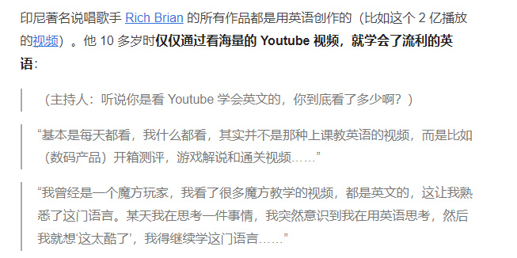

如何能够在这个行业干的更好，目前有这么一些心得

* build relationship, 珍惜能够去论坛，峰会演讲的机会，或者就自己买票，单纯去认识人
* 把maimai/领英写的专业一些，让别人来找你，同时要想个办法，了解市场什么技术招人最热（比如kubernetes就不行，不赚钱且复杂）

1. 跳出公司视角，保持对外面的竞争力(随时能够找到工作)
2. 多写代码，多写scaffold(脚手架)/scratch
3. 积累迁移能力/通用能力
4. 善于总结工作和业余时间
5. 发现身边人的闪光点
6. 利用工具，例如GPT
7. 找到自己的专有领域，形成自己的护城河，成为go-to person
8. 架构是演进的，甚至这个项目中的那个脚本，都是我逐渐演进而写成的
9. 通过技术，润到例如坡县，形成另一维度护城河
10. 模仿是最简单，最成功的老师。模仿成功的程序员的领域，模仿别人写的github，模仿别人的blog。
11. 如果想加入某家公司，可以看他们的blog或者看看他们有没有在开源社区活跃，为他们贡献代码吧！
12. 尽量让规划，让事情变得简单，这样才能坚持下去，不要给自己安排一大堆事情，然后什么也做不好。**给自己减负**
13. 阅读文章或者使用某些工具的时候，最好记录下来
14. 追加上一条，尽量让文章中充满代码或者cmd，从而达到实战的目的，而不是干巴巴的理论
15. 追加上一条，从实战中学习，而不是空学理论。 George Hotz: 我认识的所有牛逼程序员都是以同一种方式学习编程的：他们想做一样东西，然后他们去做了，然后他们琢磨，啊，要是电脑来做就好了。他们就是这样学会的，持续地推进项目，在这个过程中学习。
    1. 甚至学英语都可以用实战理论
16. 写文章，写ppt，写design，写代码，不要一开始想太多，查太多东西开始，从一个很“搓”的版本开始，然后不断迭代优化，每一天醒来的新的一天，都会给骨架填上新鲜的血肉。
17. 最简单，最高效提升自己该行业水平的方式不是大海捞针的去看书，去找资料，而是扎扎实实，记录工作中每一个问题，每一个需要总结的地方，然后去扩展它的边界，明明只是查了一个bug，但是你扩展成了“查bug的方法论”
明明只是解决dependency缺失的问题，但是你想到的是去找到一些工具，使用这些工具，或者找行业的大佬的总结。

