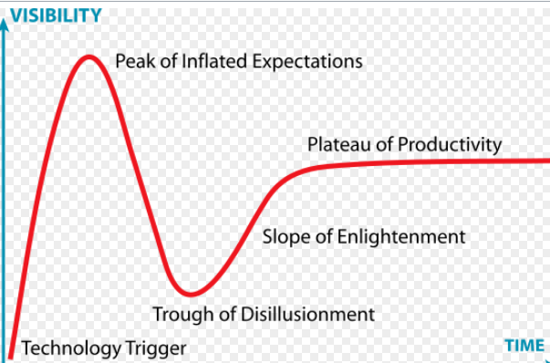

## =========
12/05 14:53

真的是痛苦万分，6月份结束了让人痛苦的数据项目，好不容易迎来了几个月写代码的时光，到12月份，又要去做数据面板
我真的是一万个吐血。为什么在这里写代码成了难事？我为什么要保持嗅觉，还不是因为想...。这种痛苦感觉让我
想到了2019年年底在tx，那个时候是加班的想死，被工作逼死。在这里是看不到未来的想死。一位资深的老大哥已经说的很直白了，
“啊？你已经待了那么久了啊“，像一根利剑一样刺痛了我的心，是啊，四年一个循环。我要快速的把一些有价值的东西列出来，
然后自己尝试揉吧揉吧。时不我待。

## =========
12/08

我的愤怒。一个normal的team就可以安部就班的去做这些那些，然后不用想那么多。而我要看那么多东西，最后还是什么都没有。
愤怒。

## =========
站在2023年年末的这个节骨眼上，看到了各种各样的新闻，突然有了以下几个问题:

* 1.地方债不断高堆，不断滚雪球，会对居民产生什么影响?
* 2.很多人说内债不是债，那么为什么不能无限举内债？
* 3.经常听到这么几个经济情况，`居民端的收入水平没有上升`，`钱留在了金融系统空转`,`内债不是债`,`城建投资大量举债会发生什么`
* 4.大量资金在地方政府财政和银行之间空转

https://chat.openai.com/share/910b7e65-aee8-4ecb-83c9-46fb7b1e2135

## =========
2023/12/16 14：59

时常会想，其实有那么多想做的事情，比如玩一玩拉尔瑞安的博德之门，想去东南亚阳光和沙滩，

想学一门乐器，想好好策划一下QH...有那么多事情，都是被这个鬼事情拖着耗着，青春小鸟就溜走了，不可以...

加油，快点结束这一切...

## =========
2023/12/24 13：41

工作很重要的一件事情就是，嗅觉。找到那些通用的，易于包装的东西或者工作的idea，然后把它保存下来，以后去了哪里，都可以吃这个老本

比如decorated 一个meeting的房间，比如录屏的时候把dynamic content的内容保存下来。比如live stream的架构等等。

## =========
2023/12/24 16：04

Generative AI任然没有一个killer user case，这会是多久呢？说来说去都是那种总结的应用场景，比如会议不需要你再去总结了。或者
是brainstorm的场景，给你一个想法或者方向，这些太初级了，有帮助，但是和人们的想象有些大。

## =========
2023/12/24 16：06

有时候想想，一定要坚信的人生信条，例如tomorrow is better，这是对的。因为无论今天犯了什么错，什么不得志，但是明天终归又有机会和概率
搏一搏，让事情变好。比如今天被裁员了，你不得已去了一家小公司或者不看好的行业，有时候就成转机了，谁知道呢？

或者熬一熬，熬到下一波需求繁荣，或者贷款利率降低，热钱非常便宜的时候，总是会有淘金者和冒险家去创业，创造需求，提高生产力。

但是要注意的是，一定要识别市场变暖的时候，并且抓住机会，一定要保持敏感度，随时准备着。

## =========
2023/12/24 16：12

大模型没有尤里卡时刻，它是预测而不是跳跃的。传统行业，例如快消等等，他们的需求，他们对程序员的需求。

## =========
2023/12/24 16：19

突然想到我和wish的故事，当时的我太傻了，不会wrapping，我竟然直接说了工作完全依赖 open resource project，应该说方案

使用了什么技术，如何做到的，而不是说写了几个yaml leverage了什么component?（主要是领域局限了）

## =========
2023/12/29 16：19

擅长做什么事情
正在做什么事情
想要做什么事情

现在回头想想，在大厂，在公司里面，要找到能够提升自己的项目/组是很重要的，要学会识别，是很重要的。对于初期的人来说，
一个具象的成熟的项目，肯定是比一个创新的，新组要好的。不要在那些没有产出的项目中浪费时间，就是你可以预见，再过6个月，也就那样
或者你前期要花大量的时间调研，这个调研是技术的调研也就罢了，甚至是需要你去厘清这个问题，确定需求是什么。这个过程是很痛苦且没有成长。

## =========
2024/01/13 12：26

花了半个上午弄Anki软件在桌面端，先试试，如果坚持且好用，那么就手机端花钱弄。

记录一些坑：
* 1.很好用得插件 [dicToAnki](https://ankiweb.net/shared/info/1284759083)
* 2.要求使用qt5的版本+登录欧陆账号的密码
* 3.Media没办法发音，因为下载地址有问题，看2023-11-07的评论(Mac)
* 有时候下载词典是没有翻译的，我猜是没有限制读取策略，导致网站限频率了。这个时候开关VPN解决
* 用一个单词去测试1.发音和2.下载词典功能是否完好
* 这个工具也不错https://github.com/qianbinbin/dict2anki

## =========
2024/01/13 13：04

shadowing的方式是有效的，比刷tiktok更好.. 长期坚持下去

针对某个视频的第一次
0.选择自己感兴趣的TED视频进行shadowing（跟不上的时候选择停顿跟读，而不是1s后跟读）
1.单词保存到欧陆词典的TED组
3.把单词卡片TED组 导到ANKI
~~2.ANKI语法卡片（文本给GPT，然后让他制作ANKI卡片）~~
~~4.把语法导入到ANKI~~

重复次
1.复习ANKI单词
~~2.复习ANKI语法~~
3.shadowing视频

## =========
2024/01/20 11：53

update上面学英语的过程，在过去的8天中，我竟然有6天都在花时间practice英语。

* 复习ANKI:单词和长难句
* 复习上次TED:跟读/shadowing上一次阅读的TED。
* 学习新的: 开始学习新1分钟的TED，对，日拱一卒。（听不懂的地方，鼠标悬停，方向键可以回倒）
* 复述：结束学习之后，用自己刚刚学到的单词和自己记得大意，重新把刚刚学的东西复述一遍。
* 耐心: 
  * 每天学习一点点，坚持是王道。
  * 选择自己感兴趣的语料，我就学到了ChatGPT训练过程 
    * 1.提供data，无监督学习，预测下一个word。
    * 2.给feedback，引导它如使用从data学习到东西，把过程泛化。

## =========
2024/01/20 12：13

这个星期最难受的事情是没管住嘴，没明白自己为什么要说这么多。吐了，我现在能理解他为什么会有那种想法了：

你还不如什么都不告诉我，告诉我，我还煎熬，保守秘密是最煎熬的。

## =========
2024/01/28 12：13

最近疯狂看了很多苹果Apple vision pro的[视频](https://www.youtube.com/watch?v=4Ome_fIcvO0)，对这个很感兴趣。随便记下几个点：

* Apple vision pro是第一个还没有上市，apple就冠名pro的产品
* AVP是多种积累的技术糅合在一起，产生涌现的效果，类似于LLM
* AVP积累的多年的多种技术, 苹果认为理应超越iphone几倍价格
  * LiDAR,FaceId,ARKit => AVP通过电子眼感受现实世界
  * 声学实验室坐Homepod，Mac轻薄机身突破音质上限, Airpods计算音频，空间音频的效果 => AVP扬声器 拟真声学效果
  * Iphone逐年升级摄像头，升级计算摄影/摄像头的图像处理 => AVP 低延迟，画面优化，实景和渲染3D的画面叠加计算
  * Apple 10年前收购ARM布局 => AVP 低功耗高性能的M2和R1芯片 12ms超低延迟
  * Apple Watch UI照搬到了AVP，数码表冠的操作逻辑移植到了AVP
  * U1芯片设备感知问题，Pro motion屏幕解决了功耗和显示效果平衡，ARM解决了跨平台App（保证AVP有很多应用），Siri解决了语音助手而不用手
  * ...

同时，无论是对于AVP还是LLM，对于VR/XR/MR来说，都符合技术成熟度曲线

* 科技诞生的促动期（chatGPT横空出世 2022年12月）
* 过高期望的峰值（2023年一整年，各种AI的tool，agent，概念，但是没有出现killer user case）
* 泡沫化的低谷期（还没有发生，表达的是市场逐渐理性，认清了客观限制，然后寻找实际的经营方向）
* 稳步爬升
* 成熟期

如果AVP代表未来，短期高昂的价格，出货量很低（2024预估13-15万台，且下调过），那么它就会走一下坡，但是苹果赌，这就是未来的产品形态。

作为一个普通人，我能做的：
* 不断定投苹果股票
* 提前做技术储备，开始研究AVP上的开发

对于LLM来说，坚持关注业内变化，积累技术储备（向量搜索），然后定投微软股票

## =========
2024/03/14 10：34

真的太难熬了..太难熬了，这一周，各种想在脑子里面打架:
* 我是不是不是第一优先级?
* 是不是起草letter就是要花这么久
* 又或者其实就是最坏的结果？
* bk py是不是其实在暗示我沃夫冈?

再次鼓起丧失的勇气
再次鼓起丧失的勇气

## =========
2024/03/15 10：34

好消息：还在牌桌子上
坏消息：横向对比

突然一下子，所有的希望破灭的那种感觉，太难受了... 
但是直到听到那句话：“我记得以前的你是很自信的” 对啊，那种无敌自信去哪里呢？ 嗯做好一切准备！

我不想被别人牵着走，不想像是求人一般的哀求。我寄希望的只有自己的能力和运气。

## =========

Top of the top of mind

* 坚持练习英语和记英语单词，暴露出来的英语能力的担忧和需要加强
* 坚持系统设计，尤其是看alex xu的书和大公司的blog，学习他们如何解决一些问题，follow up是什么？以及，系统看多了，就能一眼看出来，离线的，在线的，读写侧重，第三方限流...
  * 花钱模拟https://baozitraining.org/#mock_interview
* 坚持做算法题和归类，养成周末做contest感受那种有压力，短时间要做出题目的刺激感，做题的能力上来了，哉在了系统设计和英语。

## =========

2024/03/18 18：29

美妙！太美妙了！

2024/03/23 18：29

过去一周，心情从想要重新振作，然后接受到喜讯，再到狂欢，真的时坐过山车。

好几天只睡了3-4小时，单纯开心，兴奋。

## =========

2024/03/18 19：14

为什么想走呢？
* K8S不是主流，不好跳
* 没有own服务的机会，没有办法锻炼写代码的能力
* 自己的投入学习是无意义的，因为随时会被砍
* 未来的重点方向不是自己想的

## =========

2024/03/23 19:14

终于去了我心心念念的apple vision pro体验! 这些是我提前准备想要体验的内容：
* 1.原生恐龙体验:Encounter Dinosaur
* 2.全景照片
* 3.空间视频
* 4.环境沉浸式,Environment: 比如月球 沙滩 海边(Environment)
* 5.PPT大会堂演示
* 6.看3D电影和视频的体验(Apple TV有有一些是全景视频，有一些是裸眼3D, Disney+有漫威系列和漫威大楼)
* 7.Jig Space App: 可以看到一些机械制造，F1赛车，血管
* 8.冥想

等真正体验的时候，由于这一块国内市场的不成熟，导致体验不好，尤其体现在:
* 产品往往已经开箱过了，没有新手教程，工作人员需要主动提示你测眼距，要不然眼部识别很差
* AVP其实很重，所以一定要准备好第三根带子，帮助用户戴上
* AVP所有物理能调节的地方，帮用户调节好，尽量减轻不适感
* AVP目前全英文，对于一定的客户群体很难
* AVP提前帮用户投好屏，这样工作人员能够帮助客户解决一些问题，毕竟你是看不见AVP
* 提供更多原生体验好的app，不要指望客户自己去寻找，我因为很关注这个，所以我知道。

自己实际的一些体验：
* 3D视频，沉浸式environment无敌！
* 重新测过眼距后，眼球追踪和手势识别非常精准，傻瓜式操作
* 真的很重，需要第三根带子
* 不知道为什么，眼睛很累很疼，感觉需要在里面主动眨眼睛才行
* 看Apple TV视频时不能投屏，由于版权原因，会一片黑

一些遗憾和下次去补进的：
* 玩Jig Space app
* 玩更多native app
* 尝试阅读网页和刷youtube等等操作

## =========

2024/04/12 11:14

偶然想到，2019-2021年间，偶然接触到了K8S，然后云原生，然后感觉这个就像一把火一样，
这个就像是未来一样，感觉不学这个就落后时代了一样。

有时候在想，会不会这个就是信息茧房，困住了中文互联网的人（我自己），回过头来看，K8S和云原生，
是不是不是那么的夸张？

## =========

2024/05/19 16:15

* 最近用了percento这个记账软件，完美解决了我的这个需求，之前一直在备忘录中记录总资产的变化
不禁引发了自己的思考，简洁，美观，解决需求的一款app，不就是自己苦苦追求的吗？
满足了自己希望有一款属于自己产品的梦想吗？一款创造税后收入的产品！这就是自己的目标，加油！
  * 同时也在想，再怎么努力记账，也没有办法让账目增多，只是更加清楚自己的资金去向
  * 为什么不做一个大一统的工具呢？把所有能够数字人生都涵盖的工具，就像是readwise一样，包含percento，包含jump，包含所有的一切，叠加AI的能力
* 从4.15到5.15 入职超过一个月了，真的很开心，又加入了一家称心如意的公司，满足自己对技术的要求，和工资增长的需求。
* 心意的房子又一款成交300w的！！眼看着从450w跌到了300w，真的太开心了！不禁让我思考了一个问题，如果300w，我会买吗？如果不会，
那是不是说明还不是自己想要的房子。
  * 因为房子和自己工作的城市不一样，就在思考，买了自己也不能天天享受，制约我的，那不就是工作地吗？因此
  又回到了第一个想法，一定要有自己的产品，才可以自由自在的选择在不同的城市工作，才可以不会整天担惊受怕行业变动。。。
