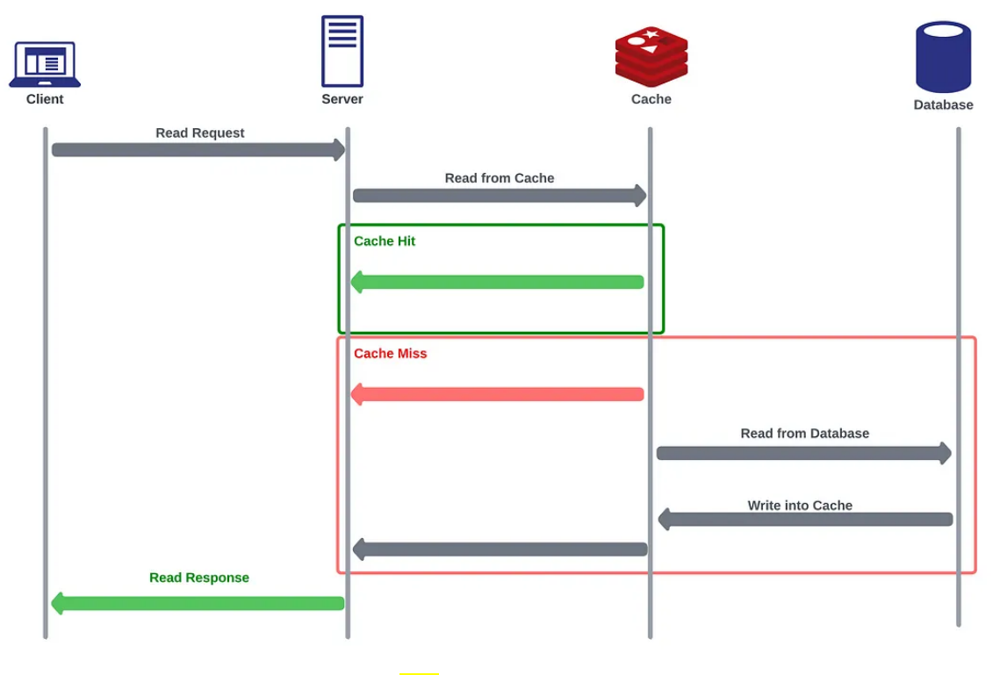

---
title: 系统设计常见问题
date: 2020-11-29 17:30:09
categories:
- System Design
---

## redis和数据库同步问题

### 1.缓存穿透(cache aside or Lazy Loading)

* 缓存命中直接返回。
* 缓存miss，从DB中查询，写入cache然后返回。
* 应用程序负责更新cache

优点：
* 简单灵活,因为应用程序决定一切，这意味着redis和DB的数据结构可以不一样
* 对于热点数据，可以减少数据库的负担。
* 节省资源，只有被请求的数据才会变成缓存中。

缺点：
* 冷启动，缓存是空的，这意味着最初的所有请求都需要访问数据库，直到缓存逐渐建立起来。
* 缓存可能会大量失效，导致加大数据库的访问。
* 如果数据库中的数据被修改，而缓存中的数据还没更新，就会出现数据一致性问题。

### 2. 绕行式写入缓存(Write Around Caching Strategy)

* 当应用程序执行写入操作时，数据会直接写入底层数据存储或数据库，而不是立即存储在缓存中。
* 写入时，如果缓存有相应的key，主动使缓存失效利用EXPIRE指令。
* 更新缓存依赖读操作（结合Cache aside）

将#1和#2结合在一起的优缺点，这种适用于读多写少，并且热点数据明显的情况：

优点：
* 通常结合cache aside和Write around策略，保证一致性
* 节省资源，降低非热点数据的写入cache。

缺点：
* 当数据频繁更新和读取时，存储系统会被多次访问，导致缓存操作效率较低。
* 安全问题，故意查询不存在的数据去访问DB，把DB拉垮（布隆过滤器可以100%确定不在集合中的数据，使用布隆过滤器，当不存在该数据时，直接返回）

* 变种:
    * 对一致性要求特别高而对写入性能没那么高: 这个时候同时更新Redis。
    * 对写入操作的性能要求特别高: 可以依赖TTL使其过期或者用EXPIRE指令让Redis过期，依赖读取的时候会更新值。

### 3.Read-through

这个和cache side最大的区别使，cache充当应用程序和database的媒介，cache本身负责从底层数据存储或数据库中获取数据。

这种多由PaaS服务提供，如DynamoDB Accelerator(Amazon)，Azure有没有我不知道。

优点:
* 应用程序只需要从缓存中读取，简化了应用程序代码。

缺点:
* 系统不能容忍缓存故障，因为缓存在数据检索过程中起着至关重要的作用。 
* 缓存和存储系统必须共享相同的数据模型，限制了处理不同用例的灵活性。
* 需要写入策略解决一致性问题。**例如cache刚刚从storage中读取数据并更新，但是storage再次被更新了。**

### 4.Write-Through

当应用程序执行写入操作时，数据会同时写入缓存和底层数据存储或数据库。这确保了缓存和数据存储之间的数据始终保持一致。

优点：
* 数据一致性：由于数据同时写入缓存和数据存储，因此缓存和数据存储始终包含一致的数据。

缺点：
* 直写会引入额外的写入延迟，因为该操作必须在缓存和存储系统上执行。

#3和#4的结合怪怪的...

### 5.小结

缓存和存储通常是独立的系统，写入顺序无非就是先写入存储，后写入缓存，还是先写入缓存，后写入存储。

通常来说，数据先写入存储，再写入缓存，这个是最安全的，如果写入缓存失败，那么读的时候直接去DB，数据反正已经持久化了。

反之，缓存有某种数据但是DB没有，这个是负面效果。

## 分片

https://ddia.qtmuniao.com/#/ch06

## 
常见性能优化思路
常见扩展系统的思路

分片的场景算法
SQL和Non-SQL如何抉择?
缓存失效和缓存不命中怎么办

## Reference

* 1.[redis sync with database](https://medium.com/@abhirup.acharya009/caching-system-design-fundamentals-226795bd9072)
