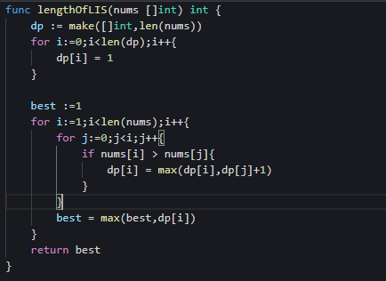
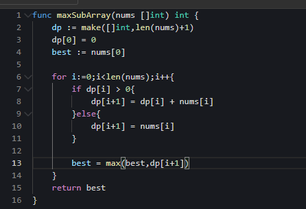
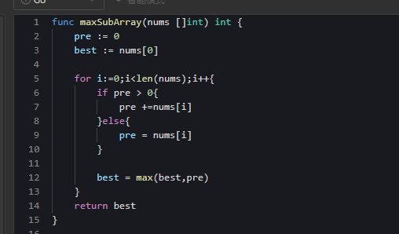
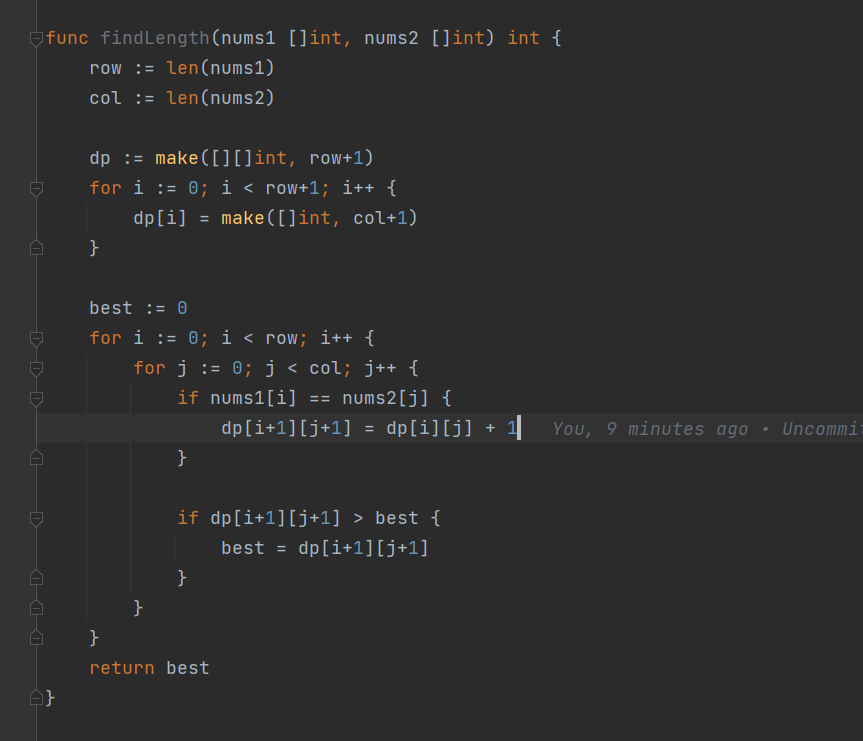
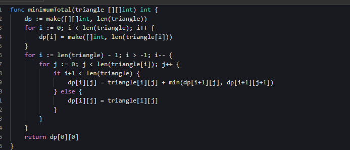
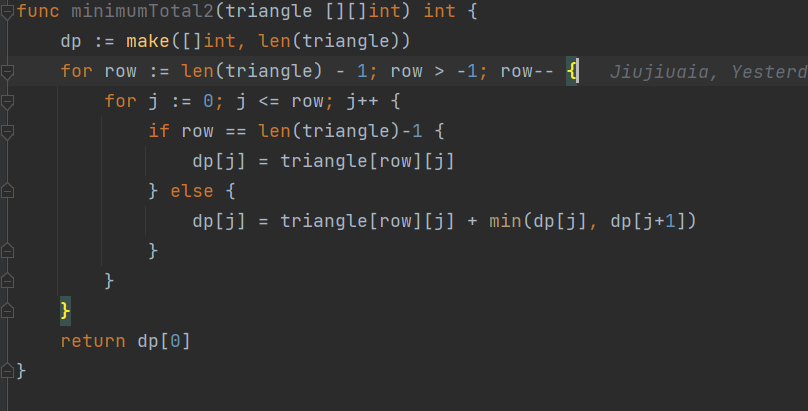
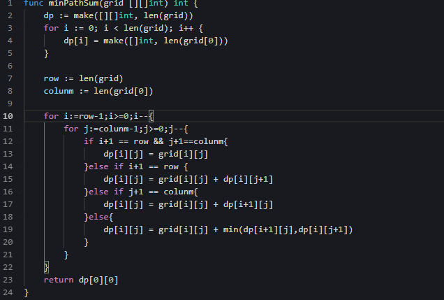
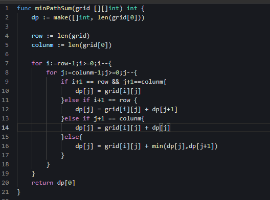
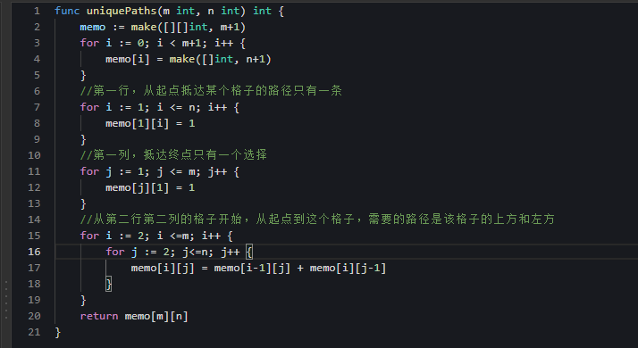
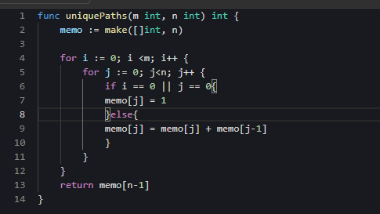

# 动态规划解题技巧
Tip1 文章侧重点在于为什么状态是以nums[i]为结尾的，这篇文章重点讲解法和类别

# 以nums[i]结尾的最大值和前i个元素的最大值有什么区别？

以nums[i]结尾的状态定义，意味dp[len(nums)]不是极值，因为极值可能出现在dp[j] 或者dp[j-1]也就是部分数组构成的集合中，代表题目为300或者53

以前i个元素的状态定义，意味dp[len(nums)]就是结果，代表题目是打家劫舍，最大的偷盗结果肯定是把数组走完

# 那么如何知道是选择nums[i]结尾的还是前i个元素呢？

以下面的题目举例，这个选择和数组/字符串是子序列还是子数组是无关的。

如果选择只看**当前状态**比如nums[i] == nums[j] 或者str[i] == str[j]，那么dp状态表示前i个元素的极值

如果选择要看nums[i]和nums[i-1]，甚至是nums[j]的话，那么dp的状态表示的是以i元素的结尾的子序列/子数组的极值

## 1.单串线性 DP 问题

单串线性 DP 问题：问题的输入为单个数组或单个字符串的线性 DP 问题。状态一般可定义为dp[i]，表示为以nums[i]为结尾的相关解

### 1.1 300最长递增子序列

定义状态dp[i]表示为：以nums[i]结尾的最长递增子序列长度。

状态转移：由于是子序列而不是子数组（序列意味着不间隔），因此以nums[i]为结尾，应该和0-j区间每一个元素去比较，如果nums[i]>nums[j],那么dp[i]=dp[j]+1，否则就是dp[i]

初始状态：由于每个元素都可以是子序列,所以dp数组的value为1

复杂度：时间复杂度O(N^2),空间复杂度O(N)

优化：无，滚动数组的优化只能是递推关系式是dp[i]和dp[i-1]之间，然后数组不需要存那么多才可以优化，这个是dp[i]和dp[j]之间

### 1.2 53最大子数组和

定义状态dp[i]表示为：以nums[i]结尾的最大子数组和

状态转移：由于是子数组，这意味着有相邻元素的性质，因此，如果dp[i-1]<0,那么dp[i]=nums[i]，无论nums[i]是正数还是负数，如果dp[i-1]>0，那么dp[i]=dp[i-1]+nums[i]

初始状态：因为会看i-1,所以要考虑dp[0]的情况，dp[0]=0，意味着以nums[0]为结尾的子数组最大就是自己

复杂度：时间复杂度O(N),空间复杂度O(N)

优化: 由于只有dp[i+1]和dp[i]有关系推导，因此可以用一个变量表示dp[i]

## 2.双串线性 DP 问题

问题的输入为两个数组或两个字符串的线性 DP 问题。状态一般可定义为dp[i][j]

同样的，有两种状态表示，一种是nums[i]和nums[j]结尾，另外一种是前i个元素和前j个元素

### 2.1 1143 最长公共子路列

状态定义：dp[i][j]表示以text1中的前i个元素组成的str1和text2中组成的子字符串str2的最长公共序列为dp[i][j]

状态转移讨论: 如果str[i] == str[j]，那么dp[i][j] == dp[i-1][j-1]+1,如果str[i] != str[j], 那么dp[i][j] = max(dp[i-1][j],max[i][j-1])

初始状态：因为会看i-1,所以要看dp[0][j]和dp[i][0]的情况，任何一个字符为空，那么公共子序列都是0。

#### 问题

同样是子序列的题目，为什么不像300一样，定义成以i和j结尾的最长公共序列呢？

因为如果300定义的是前i个元素，那么nums[i+1]和nums[i]之间没有递推关系，哪怕nums[i+1]>nums[i],由于dp[i]中是前i个最长的，有可能是以nums[j]结尾的子序列，那么nums[i]不一定大于nums[j]，

因此300不能这样定义状态。如果53定义成前i个元素，那么即使dp[i-1]>0,但是由于nums[i]和dp[i-1]所代表的子数组，不一定连续，所以也不能递推。

而1143不同，它不需要比较str1[i]和str[i-1]（str2[j]和str[j-1]）的关系，只要str[i] == str[j]，那么就可以直接递推了。

### 2.2 718 最长重复数组

状态定义：dp[i][j]表示以nums1中的前i个元素和nums2中的前j个元素的最长公共子数组为dp[i][j]

状态转移讨论：如果nums[i] == nums[j]，那么dp[i][j] == dp[i-1][j-1]+1,如果nums[i] != nums[j]，那么dp[i][j] = 0

初始状态: 因为会看i-1,所以要看dp[0][j]和dp[i][0]的情况，任何一个数组为空，那么两个公共子数组都为0

优化：可以用滚筒数组

### 2.3 10/44/72 没有时间写了

好像字符串的这种题都是str1和前i个和str2的前j的状态定义，基本上只看当前的字符串（10是例外，我不知道为什么）

所以到时候分类讨论就好了

### 2.4 115最长子序列问题

## 3.路径问题

### 3.1 120 三角形最小路径和

状态定义：dp[i][j]表示从(i,j)到底边的最小路径和,当i=0,j=0的时候，就是题解了。

状态转移: dp[i][j] = min(dp[i+1][j],dp[i+1][j+1]) + nums[i][j],如果i=len(nums),也就是最后一层的话，dp[i][j] = nums[i][j]

初始状态：无，最后一层的dp[i][j] = nums[i][j]

优化:滚筒数组，你会发现无论是dp[i+1][j]还是dp[i+1][j+1],i+1都是一个固定的，所以可以从二维数组改成一维数组，然后保留上一层的dp[j]

值得一提：可以发现，这道题是从数组最后一层开始遍历的，而不是传统的i=0.j=0起手，为什么呢？因为dp本来就没有什么自顶向下或者自底向上的说法。迭代法喝递归法的顺序是相反的，

这道题递归是从i=0,j=0,不断递归到最后一层，迭代法就是从最后一层开始，遍历到i,j =0,0

### 3.2 64.最小路径和

状态定义：dp[i][j]表示从(i,j)到右下角终点的最小路径和,当i=0,j=0的时候，就是题解了。

状态转移: dp[i][j] = min(dp[i][j+1],dp[i+1][j]) + nums[i][j],如果是最后一列,  dp[i][j] = nums[i][j] + dp[i+1][j]，如果是最后一行 dp[i][j] = nums[i][j] + dp[i][j+1]

初始状态：无

优化：滚筒数组，每个点只和自己的右边和下边的点有关系，从二维下降到一维，每次只存下一行的dp数组

值得一提：这种路径问题，有两种状态定义，一种是从起点到任意一点i,j的最小路径，另外一种是从任意一点到终点的最小路径。两种都可以，所以证明了DP题目没有范式。120最好是从任意一点到底边，因为这样
状态好推导。

### 3.3 62 不同路径

状态定义：dp[i][j]表示从起点到i,j的不同路径个数

状态转移：如果i==len(nums) or j == len(nums[0])，dp[i][j]=1,因为只能向右或者向左。其他的，那么dp[i][j] = dp[i-1][j] + dp[i][j-1]

优化：滚筒数组，从二维先下降成一维。每个点只和自己的左边和上边的点有关系。

### 3.4 63 不同路径II

不讲了，区别只有一个，如果有石头，那么那个点的dp[i][j] == 0

## 4.其他问题

其他问题分为两类，一类是选或不选的情况讨论，比如盗窃问题，另外一类是非常规的221 最大矩形问题，还有一类是非串型，比如279 343

https://algo.itcharge.cn/10.Dynamic-Programming/03.Linear-DP/03.Linear-DP-List/

## 5.背包问题

01 背包
完全背包

4.01背包和完全背包的区别？01背包是选或者不选，完全背包是可以重复选

5.对于求方案数的题目，就有恰好，至多，至少3种情况，494是恰好，如果是至多为target，只需要if target/capacity>=0就好，capacity还能够剩下。
比如从1,2,3中有多少种方法最多为target，如果target=8，那么最多就有8种办法（1,2,3有8个子集），都达不到8
