---
title:
date: 2023-09-08 23:30:09
categories:
- 博客
---

## 本地环境搭建

### 1.安装RubyInstaller

去这个网站https://rubyinstaller.org/downloads/，然后安装下面这个版本。

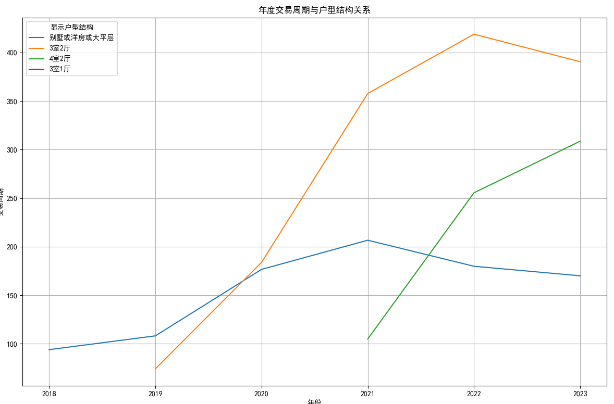

安装完成后会跳出一个terminal，press 3 然后按回车来安装MSYS2 and MINGW development tool chain

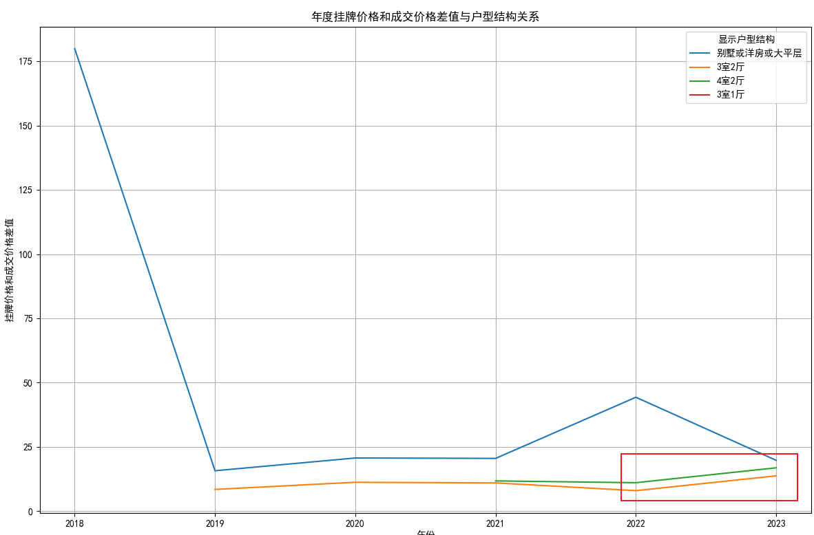

确定是否安装gem和ruby成功：

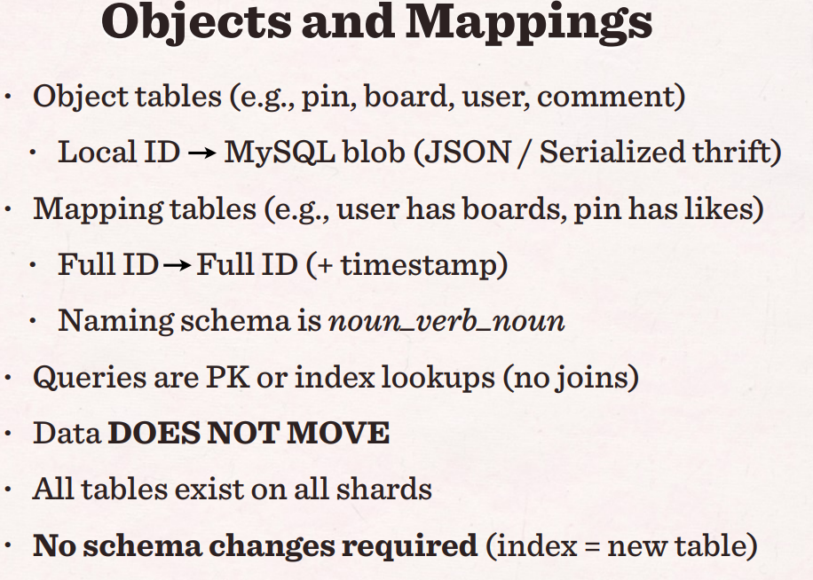

### 2.安装Jekyll

```shell
gem install jekyll bundler
```

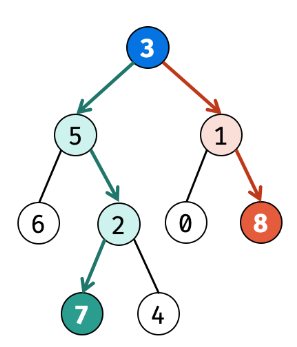

### 3.更新本地Ruby lib

首先，保证配置一致，然后删除掉Gemfile.lock

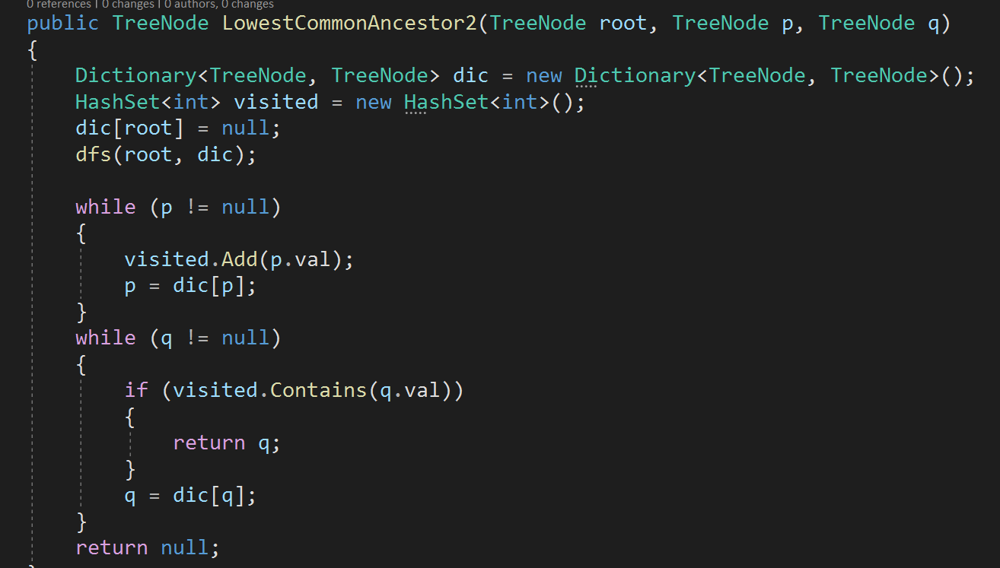

```shell
bundle install
```

会安装很多github pages依赖的lib

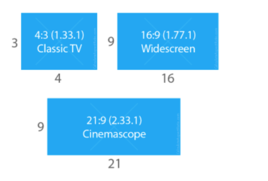

### 运行
```shell
 bundle exec jekyll serve
```

然后发现缺少webrick，执行`bundle add webrick`

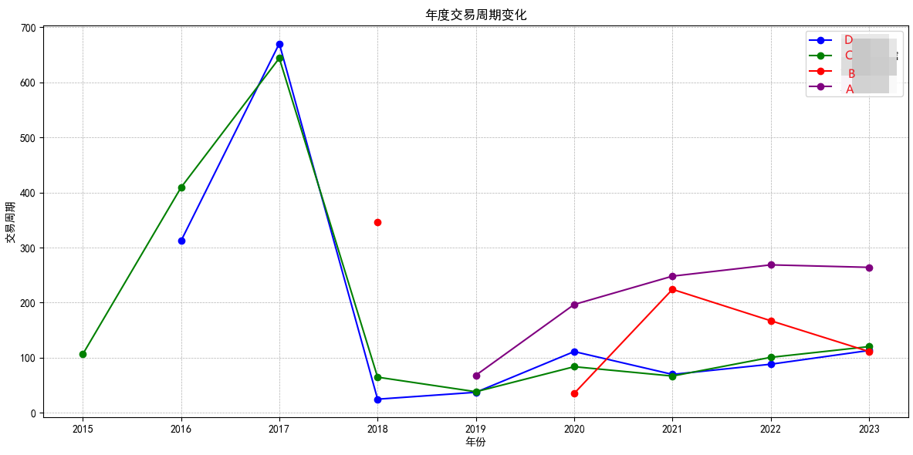

成功的截图如下：

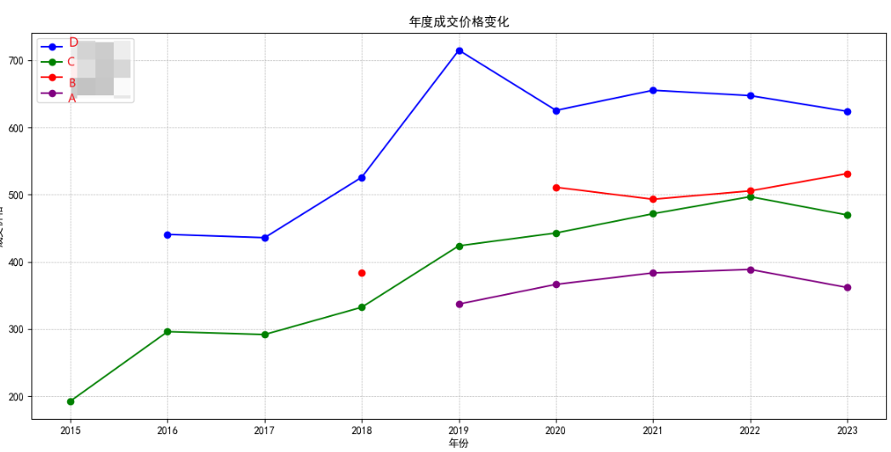

## 增加搜索功能

搜索功能依赖Simple-Jekyll-Search提供支持，可以按博客的标题、标签、时间、分类搜索。

由于index.html依赖的是layout:index，因此把搜索的前端代码放在\_layouts\index.html文件中。

并在根目录配置JS文件夹和search.json。最终效果如下：

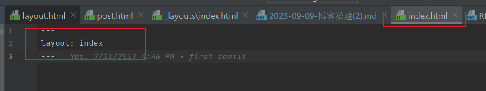

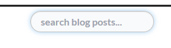

## 增加统计功能

由于所有的页面其实本质上都是在引用layout.html,比如page页面，因此我们需要把公共的功能，比如统计功能

放在layout页面下。

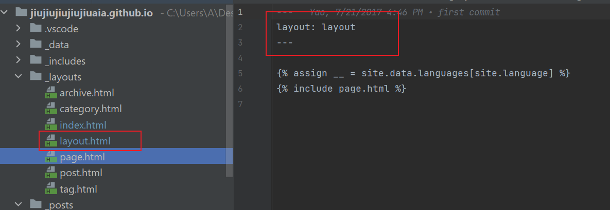

简单的增加两行代码，一行是google统计分析，一行是不算子网站分析。


## 增加评论功能(TODO)

## Reference
* 1.https://jekyllrb.com/docs/installation/windows/
* 2.模仿的博客 https://lemonchann.github.io/create_blog_with_github_pages/
* 3.https://www.cnblogs.com/huyuchengus/p/15473035.html
* 4.https://docs.github.com/zh/pages/setting-up-a-github-pages-site-with-jekyll/testing-your-github-pages-site-locally-with-jekyll
* 5.http://ibruce.info/2015/04/04/busuanzi/#more
* 6.jekyll使用笔记 https://juejin.cn/post/6844903629934084109